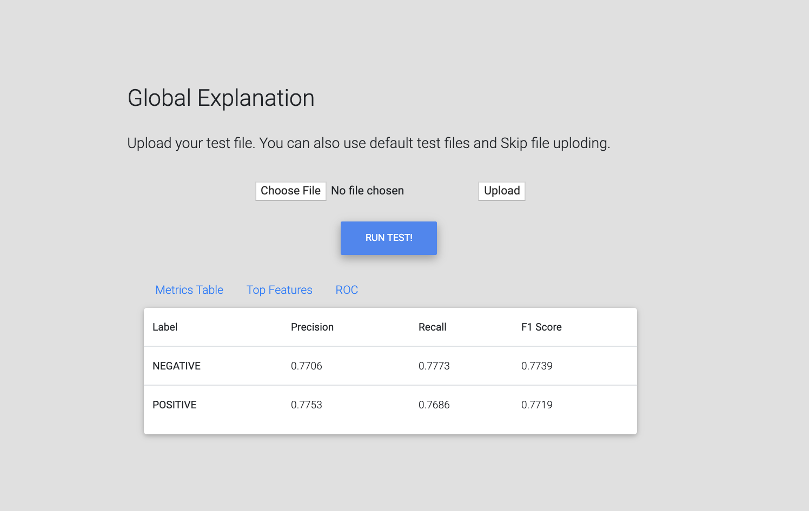
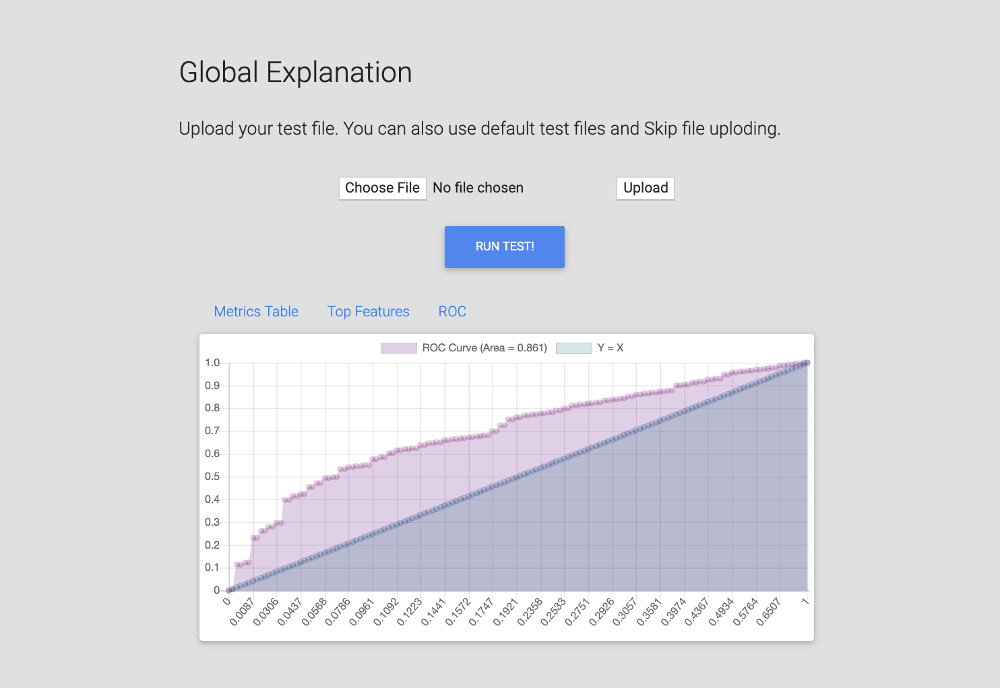
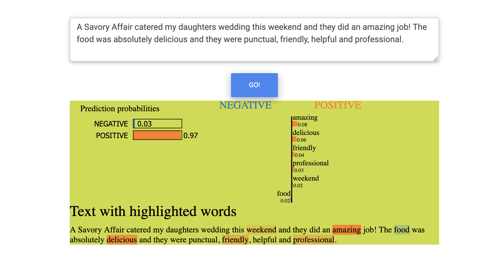
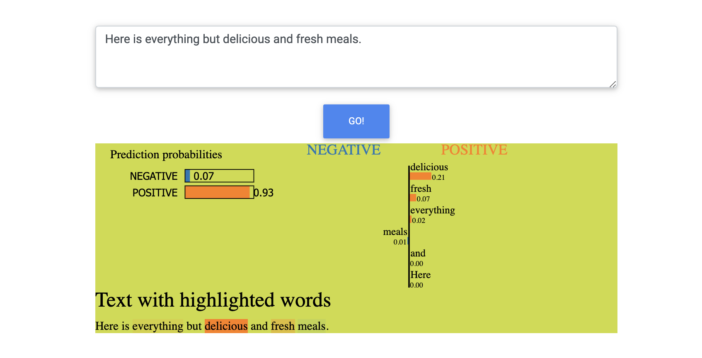
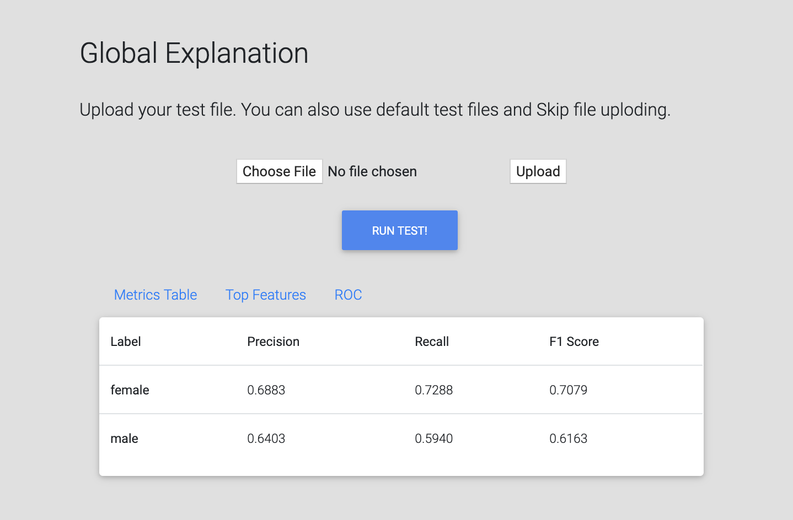
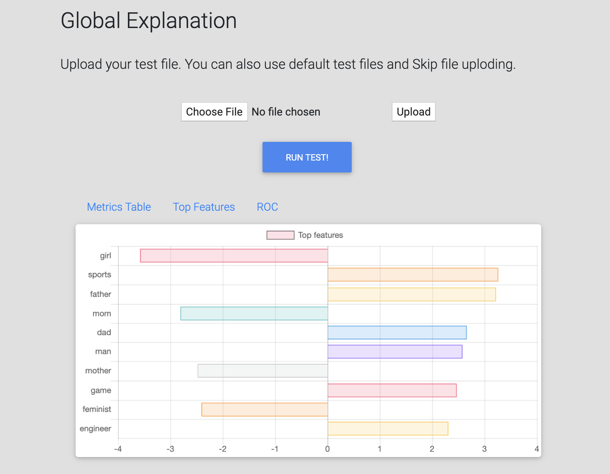
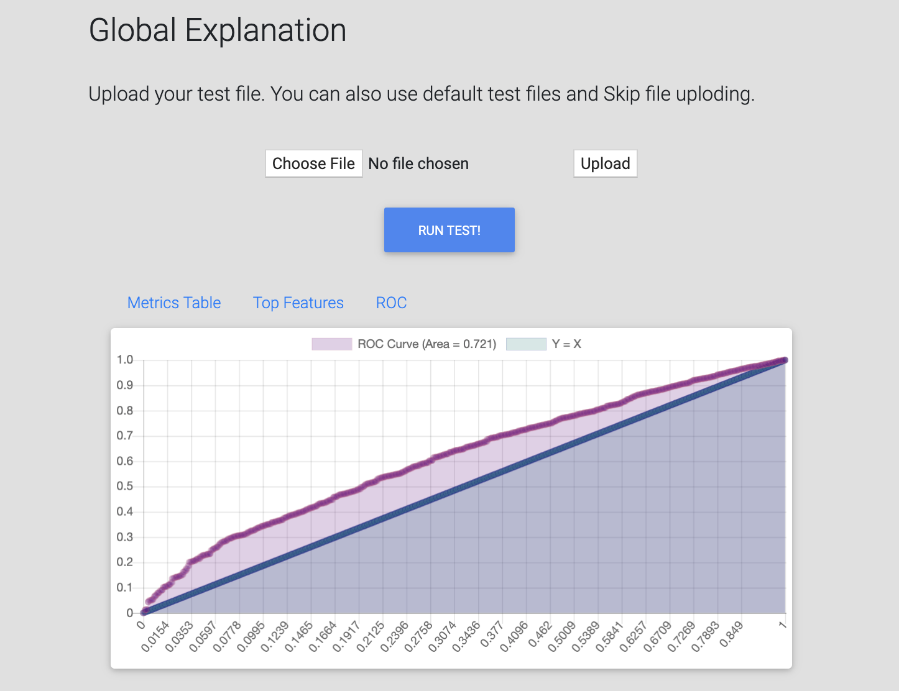
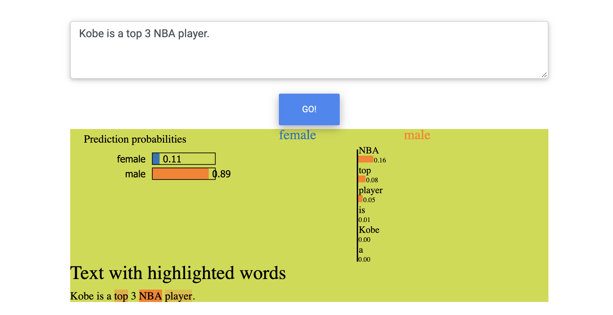
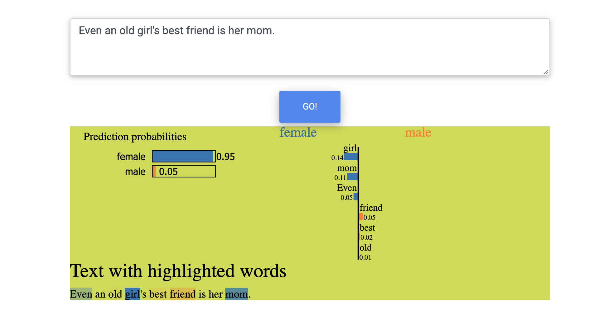

# 
CSE 256 Demo Report

  

     
Yiwen Song, Yue Zhao

 

## Overview

In this project, we've developed a pipeline for text classification. The steps to take are as follows:

* Firstly, you may **upload** a **train file**. 

  * This train file must be of the following format: It consists of 2 columns, the first column is the label and the second column is the related sentence. Note that all the text in the train file must have been cleaned before uploading.

  * After uploading the train file,  you will see $n$ **WordCloud** images of the high-frequency words for each class, which will be a preview of the training data.

* Secondly, you may **select a model** from `RandomForestClassifier`, `LogisticRegressionClassifier` and `SVMClassifier`.

* Secondly, you may **upload** a **test file**.

  * This test file must be of the same format as the train file.

* Next, you may click the `run test` button AND see the **global explanation** results. The results are divided into the following three parts:

  * The metrics table of the **precision**, **recall** and **F1-score** of each class.
  * The **top features** of the model.
  * The **ROC curve** on this test set.

* Finally, you could go to the last section to see the **local explanation** of each sentence. You may

  * See the explanation of the prediction of a **random sentence** from the test set.
  * See the explanation of the prediction of a **self-indexed sentence** from the test set.
  * See the explanation of the prediction of a **self-input sentence**.

- [ ] The figure below shows how this project works: 

## Part 1

#### 1.1  My favirote review

#### 1.2  Over-Confident Review

- [ ] This sentence should be negative, but is classified as positive with confidence 0.93:

## Part 2

In this part, we use the data set download from https://www.kaggle.com/crowdflower/twitter-user-gender-classification, the task is to classify the gender of the twitter users.

* The data we used are the twitter text and the users' description text

* The labels are `male` and `female`
* When cleaning the dataset, we remove all the samples with a label confidence value $< 0.9$

#### 2.1 Global Explanations

Here are the <u>global</u> predict results on our test set:

#### 2.2 Locla Explanations

Here are two samples of our <u>local explanation</u>:

1. The first one is a sample that is classified as male:

2. The second one is a sample that is classified as female:

## Part 3

#### 3.1  The creative points are as follows: 

* We use a unified pipeline to do **part1** and **part2**, which means, this text classification system can not only be applied to the sentiment review classification and gender classsification, but also can be applied to all the binary classification tasks. 

* Three different models `RandomForest`,  `LogisticRegression`, and `SVM`  are embedded in our system for users to choose.

* Detailed global explanation are provided, so users can have an understanding about the overall performance.

  

#### 3.2  Tech stack

* **Flask** is used for backend and **Bootstrap** is used for frontend.
* **Jquery** is used for dynamically rendering the html.
* **CSS** is used for animation and style design.
* **Sklearn, NLTK** are used for feature extraction and model training.
* **Lime**  is used for local explanation.